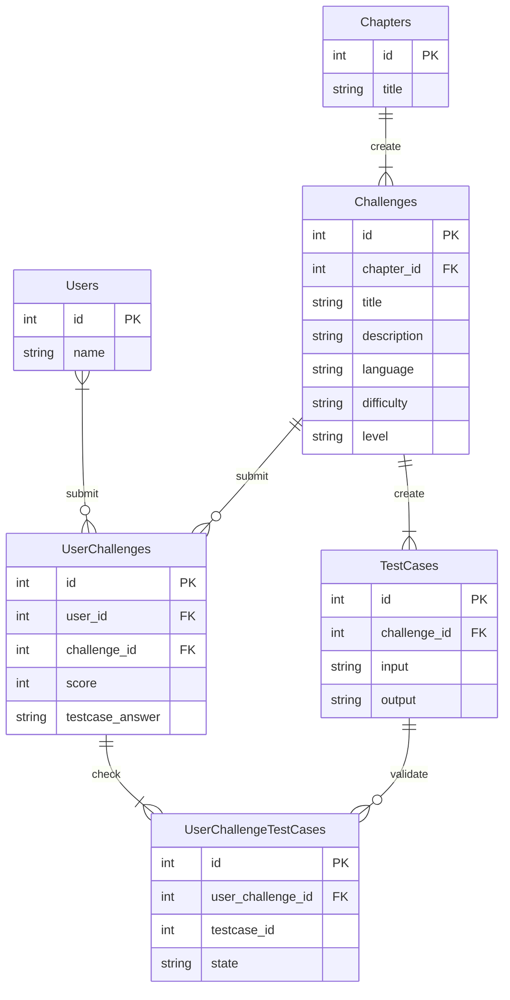

```mermaid
erDiagram
  Users {
    int id PK
    string name
  }
  UserChallenges {
    int id PK
    int user_id FK
    int challenge_id FK
    int score
    string testcase_answer
  }
  UserChallengeTestCases {
    int id PK
    int user_challenge_id FK
    int testcase_id
    string state
  }
  Chapters {
    int id PK
    string title
  }
  Challenges {
    int id PK
    int chapter_id FK
    string title
    string description
    string language
    string difficulty
    string level
  }
  TestCases {
    int id PK
    int challenge_id FK
    string input
    string output
  }
  Users }|--o{ UserChallenges : submit
  UserChallenges ||--|{ UserChallengeTestCases : check
  Chapters ||--|{ Challenges : create
  Challenges ||--|{ TestCases : create
  Challenges ||--o{ UserChallenges : submit
  TestCases ||--o{ UserChallengeTestCases : validate

```
